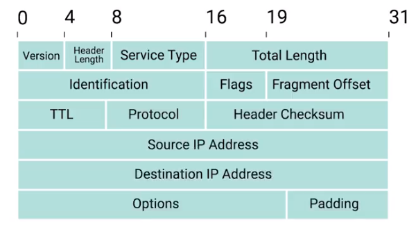
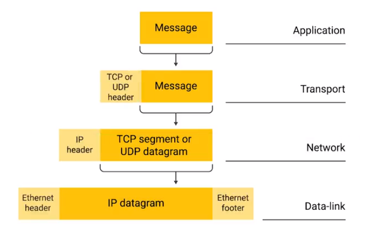

# The Network Layer (Week 2)

## The Network Layer

* Remember, on a local area network (LAN), computers communicate with one another through their MAC addresses, which is great for small scale networks.
* MAC addresses, however, don't scale well; every device on the planet has a MAC address, and there is no way to fully know where a particular device is on the planet given just its MAC address.
* The Network Layer is the solution to the problem involving internetwork transmissions.

### IP Addresses

* __IP Addresses__ are a 32-bit number made up of four octets, with each of these octets usually being described in decimal number. An example

|IP Address (Decimal): |172|16|254|1|
|-|-|-|-|-|
|IP Address (Octet): |10101100|00010000|11111110|00000001|

* Each octet must correspond to a number between 0 and 255. This means that 12.34.56.78 would be a valid IP address, but 123.456.789.100 is not a valid IP address because "456" and "789" are larger than what can be represented by the 8 bit octet.
* The decimal format (i.e. 192.168.0.1) is known as __dotted decimal notation__.
* IP Addresses are distributed by large "de facto" organizations, as opposed by being determined by hardware vendors.
    * As a result, IP addresses are better for sending and recieving data over an (or the) internet.
* IP addresses belong to networks, not to the devices attached to those networks.
    * You laptop will always have the same MAC address, but a different IP address when you sign on to different networks.
    * The LAN is responsible for assigning IP addresses to devices
    
* Through a protocol called __Dynamic Host Configuration Protocol__, a dynamic IP address is assigned to the host.
* It's also possible to manually assign a __static IP address__.
* In most cases static IP addresses are reserved for servers and network devices, while dynamic IP addresses are reserved for clients.    

### IP Datagrams and Encapsulation

* An __IP datagram__ is a highly structured series of fields that are strictly defined, like an Ethernet frame

* The __Version__ field is the version of IP addressing that is in use
    * At the moment, the most common version of __IP addressing__ is __IP version 4__ or __IPv4__...
    * ... and __IP version 6__, or __IPv6__ is a new scheme that is quickly gaining momentum.
* __Header Length__ just says how long the entire header is, it is almost 20 bytes in length when dealing with IPv4
* The __Service Type__ field is eight bits long and is used to specify the Quality of Service or QoS technologies
    * __Quality of Service__ tries to tell the router which IP datagrams are more important
* The __Total Length Field__ is a 16-bit field that indicates the total length of the IP datagram that it's attached to
* The __Identification field__ is a 16-bit number that is used to group messages together
    * The maximum size of a single datagram is the largest number that you can represent with 16 bits: 65,535
    * If the total amount of data that needs to be sent is larger than what can fit in a single datagram, the IP layer needs to split this data 
* The __flag field__ is used to indicate if a datagram is allowed to be fragmented, or to indicate that the datagram has already been fragmented
* __Fragmentation__ is the process of taking a single IP datagram and splitting it up into several smaller datagrams
* __Time to Live (TTL)__ is an 8-bit field that indicates how many router hops a datagram can traverse before it's thrown away
    * Every time a datagram reaches a new router, the TTL gets decremented by one (1)
    * Once the value reaches zero (0), the router knows it doesnt have to forward the datagram any further.
    * The point of TTL is to make sure that datagrams don't "an eternity" to reach their destination in case of a network failure
    * An "endless loop" situation is where router A thinks router B is the next hop, and router B thinks router A is the next hop
* The __Protocol__ field is another 8-bit field that contains data about what transport layer protocol is being used
    * With TCP and UDP being the most commonly used
* The __header checksum__ field is a checksum of the contents of the entire IP datagram header
    * because TTL has to be recomputed everytime it reaches a router, the header checksum is in effect, recomputed.
* The __source__ and __destination__ fields hold the source and destination IP addresses respectively
* The __IP options field__ is an optional field that is used to set special characteristics for datagrams primarily used for testing purposes.
* The __padding field__ is a series or zeroes used to ensure the header is the correct total size

All of this is done through the process of encapsulation, which can be seen below:

### IP Address Classes

* IP addresses can be split into two sections: the network ID and the host ID
* Given an IP address _192.168.0.1_, the "network" part of the IP address would be the left half and the host part of the IP address would be the right half
* The __Address class system__ is a way of defining how the global IP address space is split up
* There are three primary types of IP classes
    * __Class A__ IP classes are those where the first octet is used with a network ID and the last three are used for the host ID
        * If the first bit of an IP address is a zero, it's class A
    * __Class B__ IP classes are where the first two octets are the network ID and the last two are the host ID
        * If the first two bits are 1 and 0, then it's class B
    * __Class C__ IP classes are IP addresses where the first three octets are associated with the network ID and the last octet is associated with the host ID
        * If the first three bits are 1, 1 and 0, then it's class C

* Each address class represents a network range of different maximum hosts

|Class|Range|Max Hosts|
|-----|-----|---------|
|A|0-126|~16 Million|
|B|128-191|64,000|
|C|192-224|254|
|D|224-239|N/A|
|E|240-255|N/A|

* __Classless Inter-domain Routing (CIDR)__ is what is replacing the class system

### Address Resolution Protocol

* __Address Resolution Protocol (ARP)__ is a protocol used to discover the hardware address of a node with a certain IP address
* An __ARP table__ is a list of IP addresses and the MAC addresses associated with them
    * The transmitting device might also store the MAC address in it's own local ARP table

* ARP table entries generally expire after a short amount of time to ensure changes in the network are accounted for

## Subnetting

## Routing

