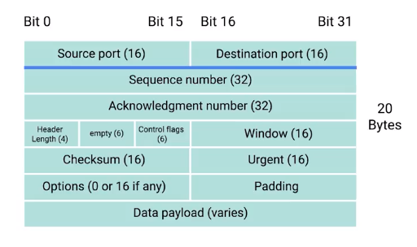

# The Transport and Application Layers

* __Transport Layer__ the layer of the TCP/IP Model that allows traffic to be directed to specific network applications
* __Application Layer__ the layer of the TCP/IP Model that allows these applications to communicate in a way they understand

## The Transport Layer

* A __port__ is a 16-bit number that's used to direct traffic to specific services running on a networked computer
* Ports are normally denoted with a colon after the IP address
    * Example, given an IP address of 192.168.0.1 and a port number of 80, we have 192.168.0.1:80
    * Written this way, it's known as a __socket address__ or __socket number__
    
### Dissection of a TCP Segment

* A __TCP Segment__ is made up of a TCP header and a data section

## The Application Layer

